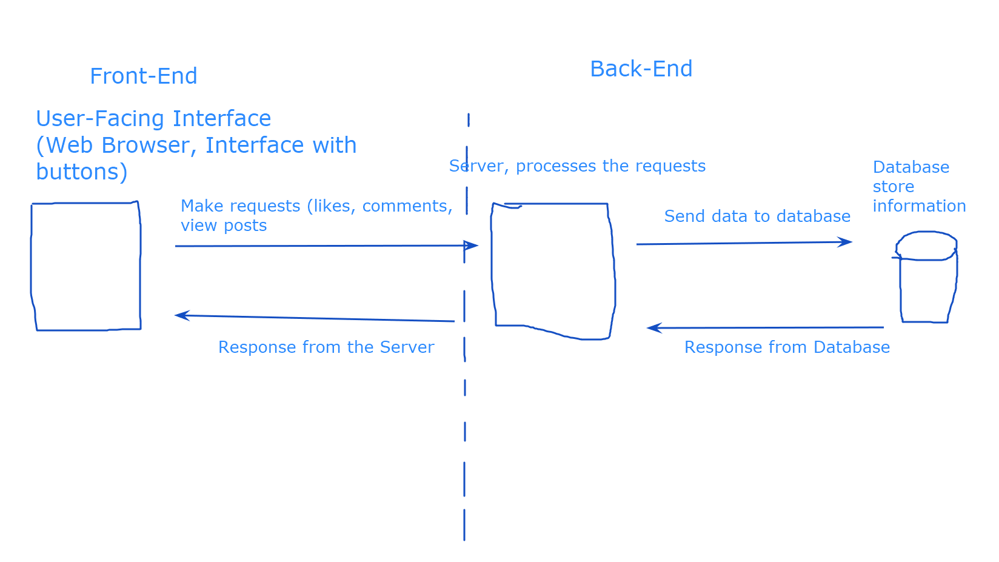

- What is programming? What is software? What is an application? 
- Giving a program its commands, telling it how to run
- Writing a set of instructions for a program to run, perform different tasks
- Program - 
    - different requirements
    - different expectations
    - comprised of different instructions
- Application - 
    - Audible, Google
    - Shortened to Apps
- Full-Stack Application
    - Front-End and Back-End
    - Front-End - what the user sees, interface
        - Design
        - Layout
        - Code to handle the logic of user-facing features
    - Back-End - hidden, performing logical operations, etc.
        - more hidden from the user
        - Code to handle different requests

